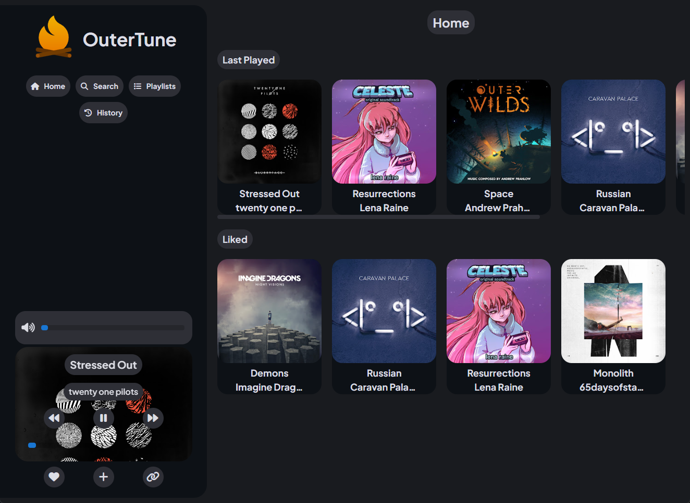

# OuterTune

<div align="center">
    
</div>

OuterTune is a music player for both Windows and Linux. With a focus on design and functionality, OuterTune goal is to be a solid alternative to your streaming services without any ads.

## Installation

Download [latest release](https://github.com/DylanAkp/OuterTune/releases/latest) or build it yourself using above commands

## Building

### 1 - Install Quasar CLI
```
npm install -g @quasar/cli
```
### 2 - Clone the repository
```
git clone https://github.com/DylanAkp/OuterTune.git
cd OuterTune
```
### 3 - Install required node modules
```
npm i
```
### 4 - Launch the build command
```
quasar build -m electron
```

Now, your packaged and unpackaged version should be available in `./dist/electron`

## Credits

- [Alexis06030631](https://github.com/Alexis06030631/) for his [YouTube Music API](https://github.com/Alexis06030631/yt_music_api)
- [FontAwesome](http://fontawesome.io) by Dave Gandy

## Licenses

- Fontawesome : [SIL OFL 1.1](https://openfontlicense.org/)
- OuterTune : [MIT](https://opensource.org/license/mit)
